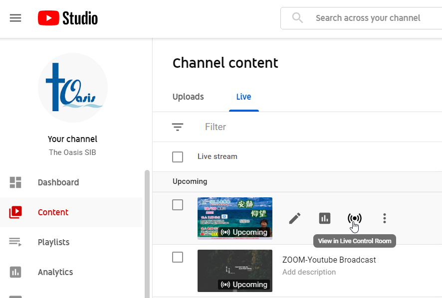
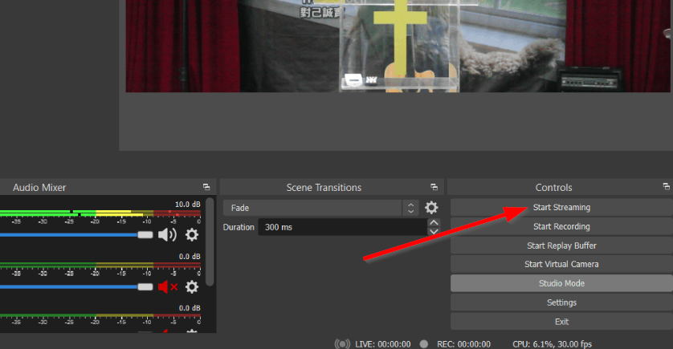
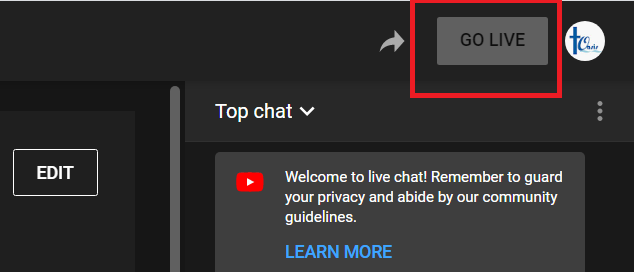

# Going Live

1. Login into the Oasis YouTube account

2. Locate the livestream and go to the **Live Control Room**:

    ??? info "Screenshot"
        {: loading=lazy }

3. In OBS, click **Start Streaming**:

    ??? info "Screenshot"
        {: loading=lazy }

4. In the YouTube Control Room, click **Go Live** to expose the livestream to the public:

    ??? info "Screenshot"
        {: loading=lazy }

