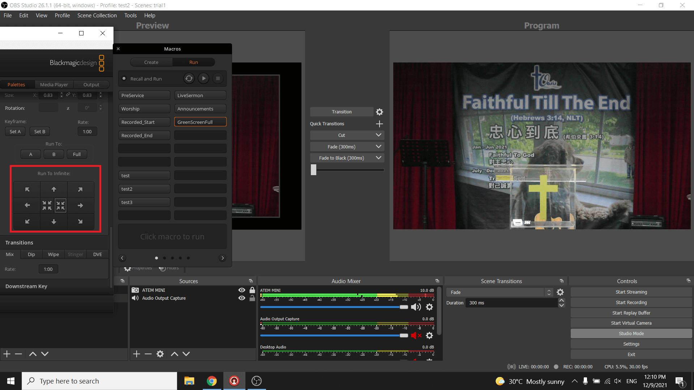

# Initial Setup

1. Open Atem Mini first:

    ??? info "Screenshot"
        {: loading=lazy }

2. Next, open OBS:

    ??? info "Screenshot"
        {: loading=lazy }

3. It is recommended that the 2 programs be readjusted as shown below:

    ??? info "Screenshot"
        {: loading=lazy }

4. In Atem, scroll the right side until the arrows are seen. The arrows are highlighted in the red box below:

    ??? info "Screenshot"
        {: loading=lazy }