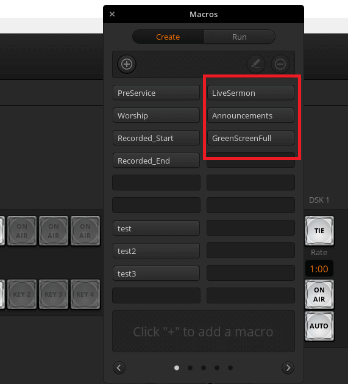

# Overview

Below is the list of all the macros. The three macros highlighted in red are the most relevant ones. They are:

* [Announcements](../Announcements)
* [GreenScreenFull](../GreenScreenFull)

The other macros are not essential for the livestream.

???+ info "Screenshot"
    {: loading=lazy }

